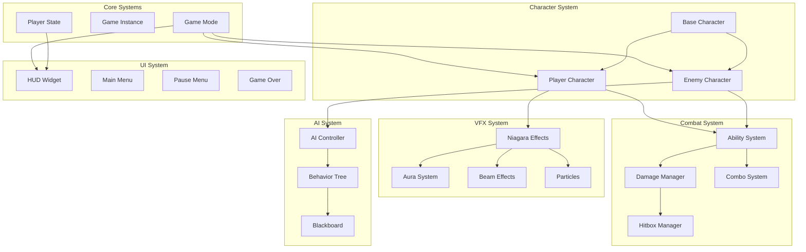
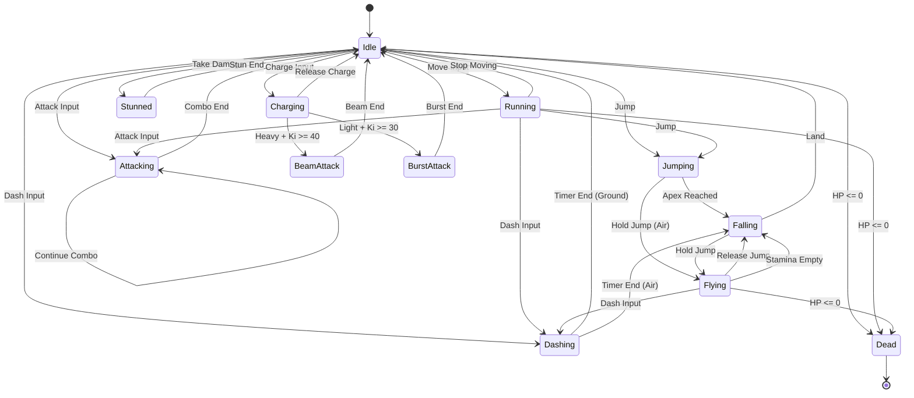
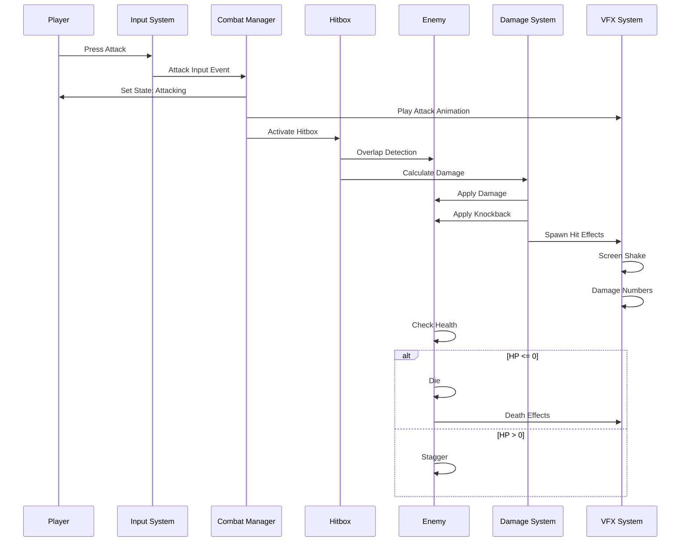
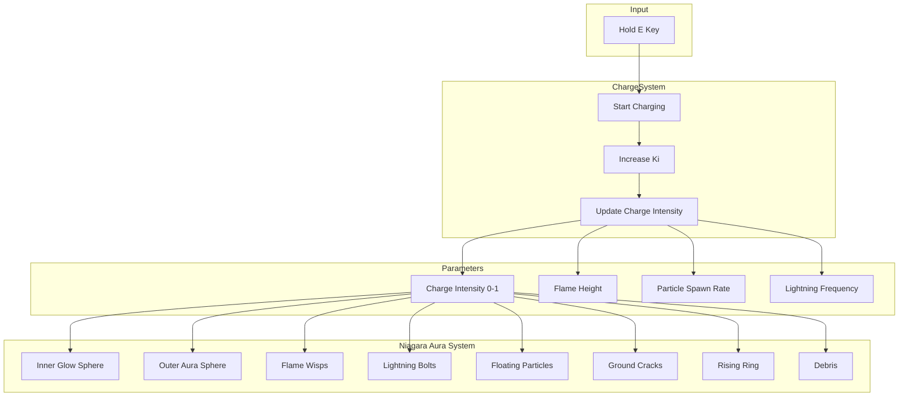
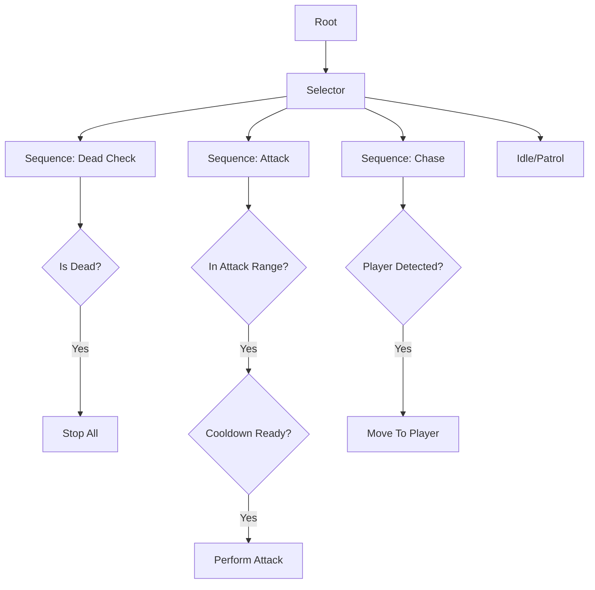
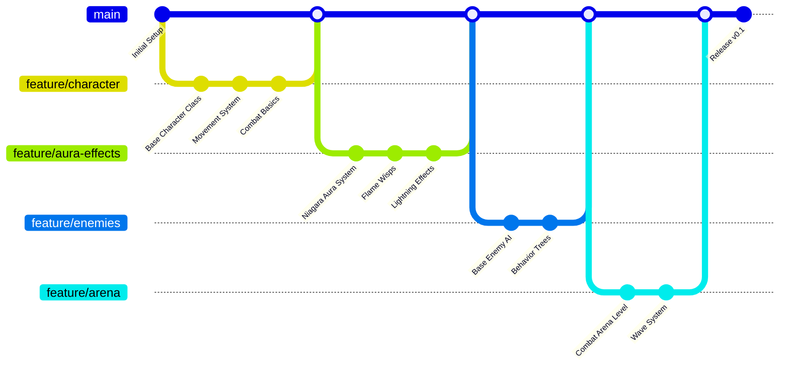

# NEON ASCENSION

> *An anime-inspired action combat game set in a cyberpunk utopia of 2099*


## Overview

Neon Ascension is a stylish, Dragon Ball Z-inspired action combat game where players possess godlike powers from the start. The challenge is mastering combat mechanics, not grinding for abilities.

### Core Design Philosophy
- **All powers unlocked from start** - Player is already powerful
- **HP is the only progression** - Grind to survive harder content
- **Style over stats** - Flashy, smooth, responsive combat
- **Dense verticality** - Flying and aerial combat are core

---

## Getting Started

### Prerequisites

- **Unreal Engine 5.7** (installed via Epic Games Launcher)
- **Visual Studio 2022** with C++ game development workload
- **Windows 10/11** (64-bit)
- **16GB RAM minimum** (32GB recommended)
- **GPU with DirectX 12 support**

### Installation

1. Clone this repository:
   ```bash
   git clone https://github.com/yourusername/NeonAscension.git
   ```

2. Right-click `NeonAscension.uproject` and select **"Generate Visual Studio project files"**

3. Open the generated `.sln` file in Visual Studio 2022

4. Build the project (F7) in **Development Editor** configuration

5. Launch from Visual Studio (F5) or double-click `NeonAscension.uproject`

### Running the Game

**From Editor:**
1. Open `NeonAscension.uproject` in Unreal Engine
2. Wait for shaders to compile (first time only)
3. Press **Play** in the editor

**Standalone:**
1. File → Package Project → Windows (64-bit)
2. Run the generated executable

---

## Controls

| Action | Keyboard | Gamepad |
|--------|----------|---------|
| Move | WASD | Left Stick |
| Look | Mouse | Right Stick |
| Jump | Space | A |
| Fly (hold in air) | Space | A (hold) |
| Dash | Shift | LB |
| Light Attack | LMB | X |
| Heavy Attack | RMB | Y |
| Charge Ki | E | RT |
| Beam (while charging) | RMB | Y |
| Burst (while charging) | LMB | X |

---

## Game Architecture

### High-Level System Diagram



### Character State Machine



### Combat Flow



### Ki Charge & Aura System



### Enemy AI Behavior Tree



---

## Project Structure

```
NeonAscension/
├── Config/
│   ├── DefaultEngine.ini
│   ├── DefaultGame.ini
│   ├── DefaultInput.ini
│   └── DefaultEditor.ini
├── Content/
│   ├── Characters/
│   │   ├── Player/
│   │   └── Enemies/
│   ├── Effects/
│   │   ├── Aura/
│   │   ├── Beam/
│   │   └── Particles/
│   ├── Maps/
│   │   └── CombatArena/
│   └── UI/
│       ├── HUD/
│       └── Menus/
├── Source/
│   └── NeonAscension/
│       ├── Characters/
│       │   └── NeonCharacterBase.h/.cpp
│       ├── GameModes/
│       │   └── NeonGameMode.h/.cpp
│       ├── NeonAscension.h/.cpp
│       └── NeonAscension.Build.cs
├── NeonAscension.uproject
└── README.md
```

---

## Development Workflow



---

## Implementation Roadmap

### Phase 1: Core Combat (Current)
- [x] Project Setup
- [x] Base Character Class
- [x] Game Mode
- [ ] Player Blueprint
- [ ] Movement System (Ground/Air/Flight)
- [ ] Basic Attack Combos
- [ ] Ki Charging System

### Phase 2: VFX & Polish
- [ ] Niagara Aura System
- [ ] Beam Attack Effect
- [ ] Burst Wave Effect
- [ ] Hit Effects & Screen Shake
- [ ] Character Rim Glow

### Phase 3: Enemies & AI
- [ ] Base Enemy Class
- [ ] Behavior Tree AI
- [ ] Enemy Types (Grunt, Elite, Boss)
- [ ] Difficulty Scaling

### Phase 4: Arena & Progression
- [ ] Combat Arena Level
- [ ] Wave Spawning System
- [ ] HP Upgrade System
- [ ] Game Over / Victory

### Phase 5: Polish
- [ ] Main Menu
- [ ] HUD
- [ ] Audio
- [ ] Animations

---

## Technical Notes

### Key Plugins Used
- **Enhanced Input** - Modern input handling
- **Gameplay Abilities** - Ability system framework
- **Niagara** - Advanced particle/VFX system
- **Control Rig** - Procedural animation

### Performance Targets
- 60 FPS at 1080p (minimum)
- 60 FPS at 1440p (recommended)
- Support for 10+ enemies on screen

---

## Contributing

1. Fork the repository
2. Create a feature branch (`git checkout -b feature/AmazingFeature`)
3. Commit your changes (`git commit -m 'Add AmazingFeature'`)
4. Push to the branch (`git push origin feature/AmazingFeature`)
5. Open a Pull Request

---

## License

This project is for educational/personal use.

---

## Acknowledgments

- Inspired by Dragon Ball Z: Kakarot
- Built with Unreal Engine 5.7
- Combat inspired by Ghost of Tsushima & Devil May Cry

---

## Author

**Dhruv Joshi**

[](https://www.linkedin.com/in/dhruv-joshi-52769b265/)
[](https://x.com/mdhruvjoshi)
[](mailto:mdhruvjoshi@gmail.com)
[](https://discord.com/users/dhruvjoshi.28)
